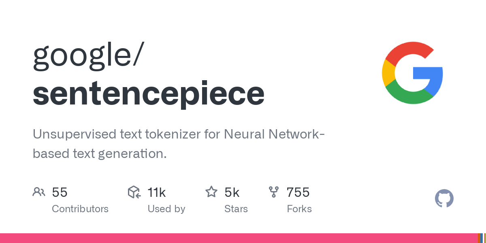
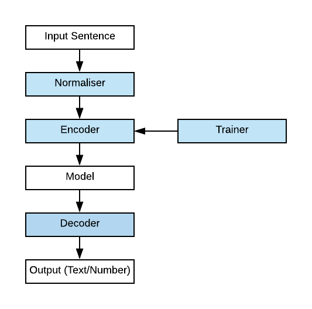

**SentencePiece Tokenizing and Detokenizing Review**

<!-- more -->

## Background

SentencePiece is an open-source tokenizer and detokenizer often used for Neural Machine Translation systems where the vocabulary size is fixed. SentencePiece takes in any raw sentence input and generates subword units for the sentence. Unlike other subword tokenizer tools, SentencePiece does not require sentences to be pretokenized by word allowing it to be language independent, working on languages like Japanese and Chinese that do not have whitespaces to segment words.

## About Subword Tokenization

Before we tackle a Natural Language Processing problem such as translation, we require pre-processing on the input data to make the information more useful for a computer. One step of pre-processing is tokenization, which is the splitting of a sentence into smaller units. Different tokenization tools will split sentences in different ways. Word tokenization merely splits a sentence by each word, for instance seperating by whitespace for most European-based languages. The issue with word tokenization is that often these vocabulary sizes get too large as a token needs to be created for every word, even if words have similar meanings.

**"This is how we do tokenization." becomes *["This","is","how","we","do","tokenization."]**

For most state-of-the-art models, subword tokenization is used. This splits each word into smaller subwords. This allows large words with similar prefixes, suffixes, or components to be split into units that convey a specific meaning. For instance, **tokenization** can be split into **token** and **ization**, which shares the **ization** token with a word like **colonization**. 

## Challenges

One challenge that subword tokenization faces is that most tools require the input to be pretokenized into words. This means that before subword tokenization can be done, a word tokenizer needs to be used on the sentence, which depends on the language of the sentence. For instance a word tokenizer for a European language that splits on whitespace cannot be used on Japanese, which does not have whitespaces. Instead specific rules need to be used which are difficult to maintain and resource expensive to process.

- Raw text: こんにちは世界。(Hello world.)
- Tokenized: [こんにちは] [世界] [。]

Another challenge that subword tokenization faces is that with word pre-tokenization, there is some information loss when performing detokenization.

- Raw text: Hello world.
- Tokenized: [Hello] [world] [.]

Here this tokenization is not lossless as there is no information in the tokens that indicates that no space should be put between the word world and the period punctuation. Instead language-dependent detokenization rules need to be implemented. With these two challenges, it is difficult to have a subword tokenization that fits into an end-to-end language-independent system.

## SentencePiece to the Rescue

To tackle the challenges, we can use **SentencePiece**. SentencePiece is unique from common subword tokenizers like subword-nmt in that it takes a fixed vocabulary size as a variable. In contrast, subword-nmt takes in a number of merge operations as a variable to be used for its underlying Byte-Pair Encoding algorithm. SentencePiece is composed of four parts: Normaliser, Trainer, Encoder, and Decoder.

**Normaliser**. Text is normalized by standardizing it to follow a suitable format. For SentencePiece, the default is NFKC Unicode. This means things that have the same meaning regardless of accents on letters are made to be the same character.

**Trainer**. A vocabulary is generated by creating subword components through either BPE or unigram language model. The input is a raw stream of Unicode characters rather than tokenized words. This means things like whitespaces are treated as a character themself by representing it as "\_" This solves the problem of information loss when performing detokenization. In addition, this also means languages like Japanese without whitespaces can be tokenized in the same way as each Japanese character is treated individually.

- Raw  text: Hello world.
- Tokenized: [Hello] [▁Wor] [ld] [.]

The above example can have lossless detokenization, being put back together completely without any additional rules. SentencePiece is able to process this at a character level with comparable speed since it uses a priority-queue based BPE algorithm instead of the naive scan of all pairs normally used with BPE. This reduces the algorithmic runtime from  to .

**Encoder and Decoder**. Encoding and decoding just refer to applying the subword vocabulary on the text, and converting it back to the full text respectively.

Finally, SentencePiece has self-contained models with no external dependencies. This means that SentencePiece with the same model file run with the same parameters on the same dataset will have the same result. 

## Experiments

### Dataset

We evaluate different preprocessing of English-Japanese translation of Wikipedia articles, as in the Kyoto Free Translation Task, as conducted by Kudo et al., 2018. The training and test data of KFTT consist of 440k and 1160 sentences respectively.

### Case Study

We compare the performance of training and segmenting among the following preprocess tools for jp and en.

- **subword-nmt w/ pre-tok**, **SentencePiece w/ pre-tok**, **subword-nmt**, **SentencePiece**

| Task  | Tool          | Pre-tok. | Time (sec) jp | Time (sec) en |
|-------|---------------|----------|---------------|---------------|
| Train | SentencePiece | no       | 99.73         | 65.26         |
|       | subword-nmt   | no       | 500.72        | 83.50         |
|       | SentencePiece | yes      | 8.23          | 14.90         |
|       | subword-nmt   | yes      | 55.01         | 53.40         |
| Seg.  | SentencePiece | no       | 7.15          | 12.48         |
|       | subword-nmt   | no       | 201.2         | 32.42         |

The key observations are:
- Training speed for SentencePiece for en is comparable for pre-tok or without. This is expected as english is already segmented by whitespaces.
- SentencePiece shows larger performance gains for jp compared with pre-tok and without, particularly compared to subword-nmt. 

## Conclusion

With SentencePiece, text can be tokenized regardless of pretokenization at speed. This means that it can be easily included in online models, making end-to-end NLP models more available. In addition, SentencePiece can be used independent of language making pre-training simpler.

## Reference 

- Kudo, Taku, and John Richardson. “SentencePiece: A Simple and Language Independent Subword Tokenizer and Detokenizer for Neural Text Processing.” In Proceedings of the 2018 Conference on Empirical Methods in Natural Language Processing: System Demonstrations, 66–71. Brussels, Belgium: Association for Computational Linguistics, 2018. https://doi.org/10.18653/v1/D18-2012.
